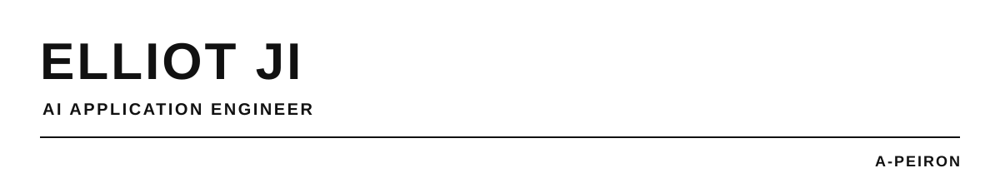

AI Application Engineer focused on Agentic and Intelligent Systems.

## Focus

Building intelligent systems at the intersection of agentic applications, multimodal perception, graph intelligence, and multi-agent learning.

- Incoming M.Sc. in Computer Science, The University of Hong Kong - From Sep 2026
- B.Eng. in Computer Science and Technology, Shanghai University
- WorldQuant BRAIN - Part-time Research Consultant (Gold Level)

## Selected Work

- [AcadVex](https://github.com/A-peiron/AcadVex) - An academic-collaboration intelligence application that combines graph learning, hybrid retrieval, and tool-using agents for scholar discovery and collaboration analysis.
- [Pose-MTMC](https://github.com/A-peiron/Pose-MTMC) - An edge-oriented multi-camera tracking system that integrates pose estimation, tracking, re-identification, and cross-camera identity association.
- [MAPPO-LSTM-Trajectory](https://github.com/A-peiron/MAPPO-LSTM-Trajectory) - A multi-agent reinforcement-learning implementation that augments cooperative decision-making with auxiliary trajectory prediction.

## Research & Exploration

- *MAPPO with LSTM Trajectory Prediction for Cooperative Multi-Agent Combat* - AICCC '25, sole author, pp. 46-54. [DOI: 10.1145/3789982.3789990](https://doi.org/10.1145/3789982.3789990)
- Graduation thesis: academic collaboration-network community mining and collaboration-potential prediction, spanning graph learning and agentic interaction.

## Now

Deepening work on agentic systems, multimodal and edge AI, multi-agent learning, graph intelligence, and AI for quantitative research.
